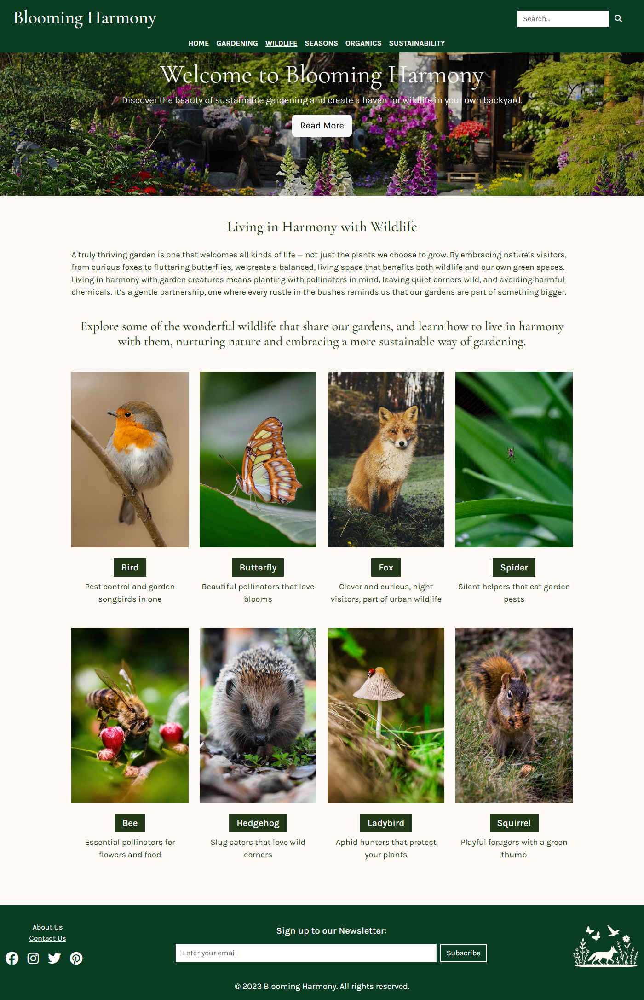
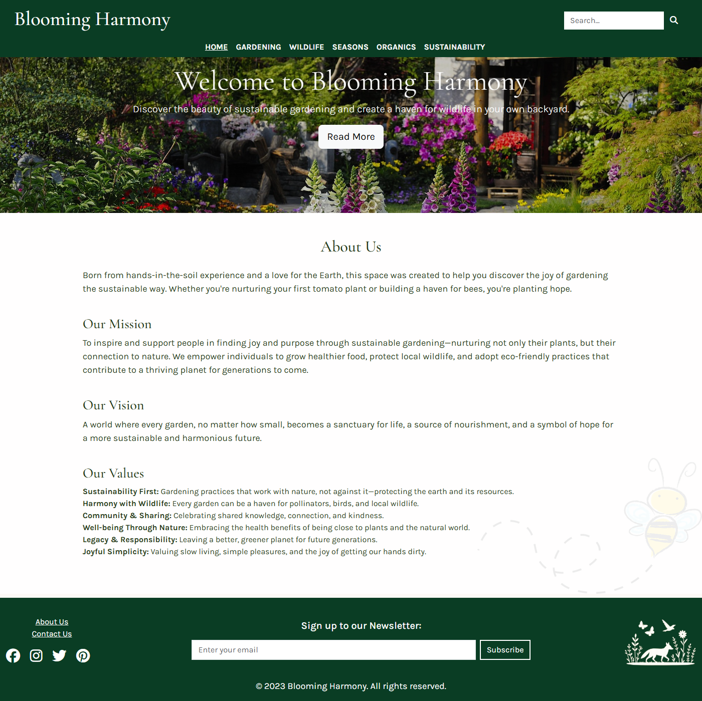
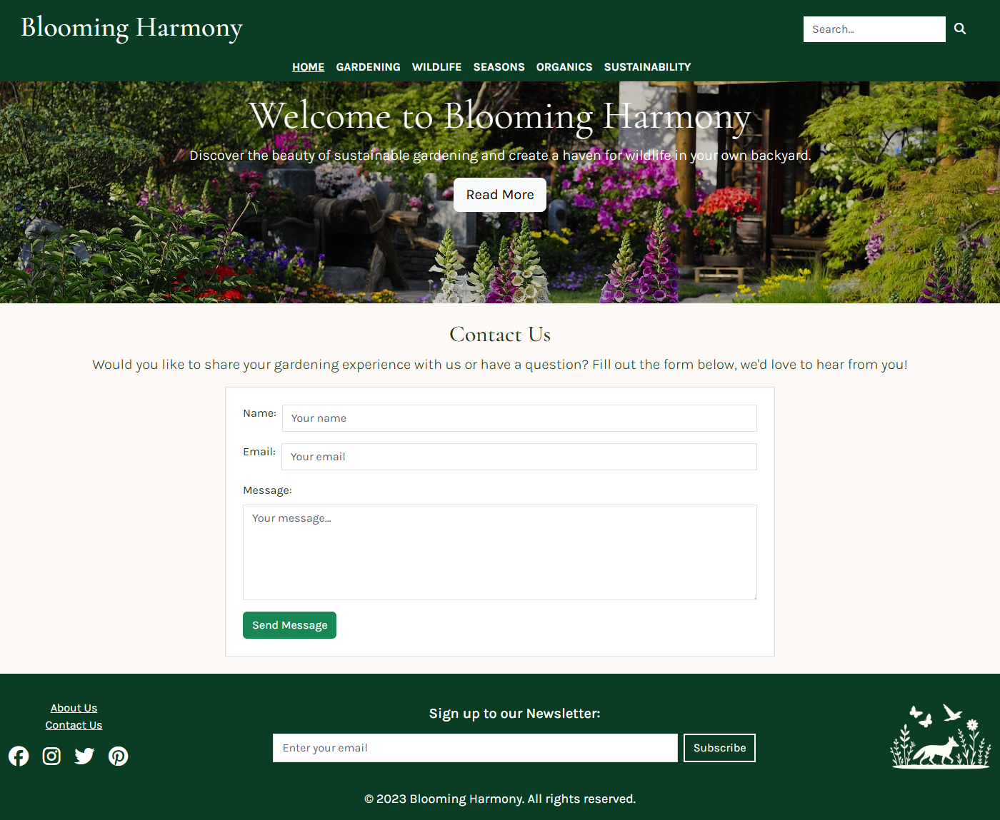
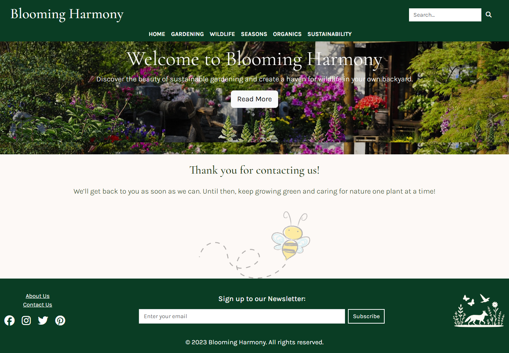

# Blooming-harmony

Look at my webpage by clicking here: [Blooming-Harmony](https://jumaxi.github.io/blooming-harmony/)

## Table of Contents

- [Project Goals](#project-goals)
- [Why this subject?](#why-this-subject)
- [Target Audience](#target-audience)
- [User Goals](#user-goals)
- [User Experience (UX)](#user-experience-ux)
- [User Stories & Acceptance Criteria](#user-stories--acceptance-criteria)
  - [User Story 1: Learn Sustainable Gardening Basics](#user-story-1-learn-sustainable-gardening-basics)
  - [User Story 2: Discover Seasonal Gardening Tips](#user-story-2-discover-seasonal-gardening-tips)
  - [User Story 3: Support Wildlife in My Garden](#user-story-3-support-wildlife-in-my-garden)
  - [User Story 4: Chemical-free Controls to Plant Diseases](#user-story-4-chemical-free-controls-to-plant-diseases)
  - [User Story 5: Grow Plants Organically](#user-story-5-grow-plants-organically)
  - [User Story 6: Navigate the Site Easily](#user-story-6-navigate-the-site-easily)
  - [User Story 7: Stay Connected](#user-story-7-stay-connected)
- [Design Justification](#design-justification)
  - [Color Palette](#color-palette)
  - [Imagery & Themes](#imagery--themes)
  - [Emotional Message](#emotional-message)
- [Homepage](#homepage)
  - [Header](#header)
  - [Hero Section](#hero-section)
  - [Introduction Section](#introduction-section)
  - [Content Section](#content-section)
  - [Footer](#footer)
- [Article Page](#article-page)
- [Additional Pages](#additional-pages)
  - [About Us Page](#about-us-page)
  - [Contact Us Page](#contact-us-page)
- [Technologies](#technologies)
  - [HTML and CSS](#html-and-css)
  - [Bootstrap use](#bootstrap-use)
  - [AI use](#ai-use)
- [Sources](#sources)
  - [Images](#images)
  - [Timeline seasons](#timeline-seasons)
- [Limitations](#limitations)
  - [Page Layout Planning (Frames)](#page-layout-planning-frames)
  - [Image Sizing](#image-sizing)
  - [Logo Placement](#logo-placement)
  - [Width on Small Devices](#width-on-small-devices)
  - [Content](#content)
- [Validations](#validations)
  - [CSS](#css)
  - [HTML](#html)
  - [Performance](#performance)
  - [Accessibility](#accessibility)
  - [Best Practices](#best-practices)
  - [SEO](#seo)
- [Screenshots](#screenshots)
  - [Homepage](#homepage-screenshots)
  - [Navbar link](#navbar-link)
  - [Article](#article)
  - [Timeline](#timeline)
  - [About Us](#about-us)
  - [Contact Us](#contact-us)
  - [Thank you message](#thank-you-message)

## Project Goals
- Create an **informative and user-friendly website** focused on sustainable gardening.  
- Promote **eco-friendly gardening practices** through articles, images, and seasonal guides.  
- Encourage visitors to **adopt organic, wildlife-friendly methods** in their own gardens.  
- Build an online space that inspires a **community of conscious gardeners** to share and grow together.  

### Why this subject?

For as long as I can remember, I’ve felt a strong connection to nature and over time, that connection has grown into a personal mission to garden in a way that nurtures both the earth and all the life it supports.

Last year, I had the opportunity to volunteer at a **community sustainable garden**, where I worked alongside others who shared the same values. That experience truly opened my eyes to the power of growing food and flowers in harmony with nature. I learned how small actions—like choosing organic seeds, composting kitchen waste, or planting for pollinators—can make a meaningful difference.

Now, as I build my own garden, I continue to learn every day. I'm discovering natural, **safe chemical-free for plant diseases**, finding **gentle ways to coexist with local wildlife** like foxes, and deepening my understanding of **composting** as a way to give back to the soil. It’s a journey of patience, observation, and care.

Through this website, I hope to share what I'm learning and encourage others to join the movement toward more **sustainable, wildlife-friendly gardening**. I truly believe that the way we garden today can help build a better, greener future for our communities, our climate, and the generations to come.

### Target Audience
- Gardeners interested in sustainable and organic practices  
- UK residents looking for climate-friendly gardening tips  
- People who want to support wildlife in their gardens  

## User Goals
- Learn the **basics of sustainable and organic gardening** in a clear and accessible way.  
- Discover **what to plant and when**, especially in the UK climate.  
- Find **natural alternatives to chemicals** for pest control and plant care.  
- Learn how to **coexist with wildlife** (e.g., foxes, pollinators, squirrels) in their garden.  
- Access **simple, actionable tips** for composting, water-saving, and soil care.  
- Be inspired by someone with real experience who is still learning and growing.  

## User Experience (UX)
- **Clean, calming design** that reflects the natural and sustainable theme.  
- **Intuitive navigation** with clearly labeled sections for quick access to topics.  
- **Visual aids** like images, timelines, and featured articles to help users absorb content quickly.  
- **Mobile-friendly layout** so gardeners can access tips while outdoors.  
- **Consistent layout** across pages to create a familiar and welcoming experience.  
- **Call-to-action buttons** (like “Read More” and “Learn More”) that gently guide users through the content journey.  

## User Stories & Acceptance Criteria

### User Story 1: Learn Sustainable Gardening Basics

As a beginner gardener,  
I want to access clear and simple information about sustainable gardening,  
so that I can start my garden in an eco-friendly way.

**Acceptance Criteria:**
- User can navigate to a "Gardening" section from the homepage or navigation menu.
- The page includes easy-to-understand language and a beginner-friendly layout.
- Articles include examples, images, and tips tailored to the UK climate.

---

### User Story 2: Discover Seasonal Gardening Tips

As a UK-based gardener,  
I want to see what to plant or do each month,  
so that I can plan my garden according to the seasons.

**Acceptance Criteria:**
- The "Seasons" page includes a visual **timeline** or calendar.
- Each month displays suggested plants, activities, and eco-friendly tips.
- Content is localized for the UK climate.

---

### User Story 3: Support Wildlife in My Garden

As a nature lover,  
I want to learn how to care for local wildlife like foxes, squirrels, and pollinators,  
so that I can make my garden safe and welcoming for them.

**Acceptance Criteria:**
- The "Wildlife" section includes advice on coexisting with common garden animals.
- Content explains safe, non-harmful ways to manage wildlife interactions.
- Visuals or guides show how to create wildlife-friendly features (e.g., bee hotels, water sources).

---

### User Story 4: Chemical free controls to plants diseases

As a gardener concerned about chemicals,  
I want to find natural and safe ways to treat plant diseases,  
so that I can keep my garden healthy without harming the environment.

**Acceptance Criteria:**
- Articles in the "Sustainability" section cover common plant issues and organic solutions.
- Remedies use ingredients that are easy to find and safe for people, pets, and wildlife.
- Users can access more detailed guides through “Read More” buttons.

---

### User Story 5: Grow Plants Organically

As a home grower,  
I want to learn how to grow organic fruits, vegetables, and herbs,  
so that I can eat what I grow without using harmful chemicals.

**Acceptance Criteria:**
- The "Organics" section includes guides for growing common fruits, veggies, and herbs.
- Each guide explains organic growing methods, soil preparation, and harvest tips.
- Content is broken down by beginner, intermediate, and advanced tips.

---

### User Story 6: Navigate the Site Easily

As a frequent user,  
I want to quickly find the section I need,  
so that I don’t waste time looking for information.

**Acceptance Criteria:**
- Navigation menu is clearly labeled and accessible on all devices.
- A search bar is present on the homepage and throughout the site.
- Each page includes consistent layout and design elements for ease of use.

---

### User Story 7: Stay Connected

As a returning visitor,  
I want to subscribe to updates or access new content easily,  
so that I can continue learning without missing anything.

**Acceptance Criteria:**
- Users can subscribe to a newsletter or updates (optional in future).
- Homepage and article pages feature highlighted or “new” content.
- Social media links are available and functional in the footer.

## Design Justification

The visual design of this website is intentionally created to reflect the heart of its message: that **gardening and sustainability can live in harmony with nature, without harming it**. Every color, image, and layout choice supports that core idea.

### Color Palette

- **Green tones** are the foundation of the palette, symbolizing **growth, renewal, and nature**. Green invites users into a calm, earthy space and reinforces the idea of living in balance with the natural world.
- **White** is used for **clarity and readability**, creating clean spaces between content and keeping the overall experience light, breathable, and uncluttered.
- **Colorful images** of flowers, vegetables, wildlife, and seasonal landscapes bring life and joy to the site. These images reflect the diversity and beauty of nature and remind users of the **rewarding outcomes of sustainable gardening**.

### Imagery & Themes

- The use of **real, vibrant images** featuring seasonal plants, pollinators, fruits, and wildlife showcases the richness of a living garden.
- Wildlife like **foxes, bees, birds, and squirrels** are featured to foster empathy and encourage readers to see their gardens as shared habitats—not just personal spaces.
- Images are used not only decoratively but also to **educate and inspire**, making the content more relatable and engaging for all skill levels.

### Emotional Message

The combination of these visual choices aims to **evoke a sense of peace, hope, and connection**. This isn’t just a gardening website—it's a gentle invitation to:
- **Reimagine gardening as an act of kindness** toward the planet.
- **Feel empowered** to make sustainable changes, even in small spaces.
- **See beauty and value in every part of the natural cycle**, from compost to bloom.

The design helps communicate that **sustainability isn’t about restriction it’s about reconnection**.

## Homepage

### **Header**
- Logo and Website Name  +  Search Bar  
- Navigation Menu:
  - **Home** 
  - **Gardening** – General sustainable gardening topics (composting, soilt health, pest control...)
  - **Wildlife** – Creating a garden for pollinators, birds, foxes, and squirrels  
  - **Seasons** – Eco-friendly planting for each season
    - Has aditional content, that is a timeline that aims help the user/gardener plann their garden over the year.
  - **Organics** – Growing organic fruits, vegetables, and herbs  
  - **Sustainability** – Water conservation, permaculture, reducing garden waste
  **Devices with less than 992px, the navigation menu + search bar, are converted in a toggle button**
  - Once the user clicks a navigation link, is directed to the a page that display our articles that are relevant image + title + short description. 
  - Clicking on the image or title, takes the user to the article page.

### **Hero Section**
- Large background image  
- Headline  
- Subheading  
- Button: **Read More**
- The button above directs the user to a page with a text about sustainable gardening and its importance and displays relevant images with a title that corresponds 
to our navigation menu.

### **Introduction Section**
- A brief paragraph explaining why sustainable gardening matters  
- Medium image alongside the text  
- Button: **Learn More**

### **Content Section**
- A quote with inspiring message about sustainability
- A image + text about wildlife and its importance with a call to action button, that directs the user to an article
- Three different images, one alongside other, with text over it and call to action button, that directs the user to an article
- A image + carousel with four images (the seasons) with a call to action button to explore seasonal advices
- Four cards with image, title, and a descripition, about general sustainable gardening topics with a call to action button, that directs the user to an article

### **Footer**
- About the website (link to a dedicated page)  
- Contact details (that directs the user to a form page)  
- Social media icons linking to profiles
- Sign up to newsletter (input + subscribe button)
- A small image, our logo, that has a link to the home page  

## Secondary pages 

### Article Page

When a user clicks a navigation menu item:

- Redirects to an article overview page
- Displays:
  - Featured image  
  - Title
  - Short description of related articles  
  - The image and the title, are links that directs the user to the content

Upon clicking **Image or Title**:

- Redirects to a detailed article page
- Includes:
  - Text content  
  - Multiple images
  - Full descriptions  

- **About Us Page:** Brief description about us, our Mission, our Vision and our Values. A small image as background that is our mascote (a bee)
- **Contact Us Page:** Form or for inquiries. All field are required. Once the user submits the form, is directed to a thank you message, that brings a warm message and our mascote.

## Technologies
This project was developed using HTML, CSS and Bootstrap. 

### HTML and CSS
I aimed to use semantic HTML tags wherever I identified it was appropriate, to ensure better structure and accessibility in my code.
I also added comments throughout to remind myself later of the reasons behind certain choices, whether it was using specific classes, 
applying particular styles, or making layout decisions.
I took the same approach with my CSS, creating custom class names that clearly reflected their purpose. 
I added comments, organised the code into sections, and structured it by hierarchy to keep everything readable and easy to maintain.
When I wasn’t sure how to use certain CSS or HTML elements, I often referred to the [W3 Schools](https://www.w3schools.com/) documentation for guidance.

### Bootstrap use
I made sure to carefully read the documentation whenever I wasn’t certain about how a Bootstrap feature worked or how it was affecting my code.
Before starting the project, I spent a good amount of time learning about Bootstrap’s breakpoints, which proved essential for building 
a responsive layout across different screen sizes.
My overall conclusion is that Bootstrap is a powerful tool for front-end development. But, it’s important to work closely with 
the documentation. There are so many features, and it’s impossible to learn everything all at once.
I also found that relying solely on Bootstrap classes can limit design flexibility. While they help make a site functional quickly,
adding my own custom CSS allowed me to achieve a more personalised and satisfying result when Bootstrap alone didn’t meet my design goals.

### AI use
I used AI in this project as a tool to optimise repetitive tasks, just as we learned in our lessons. 
For most of the main content sections, I created a general structure using <section> and nested divs with Bootstrap classes like container, row, and col.
Then, I wrote specific prompts and asked AI to generate the content I needed. Once I received the generated content, I would adjust it to fit my needs, 
for example, changing Bootstrap breakpoints for different screen sizes or applying custom styles to better suit my theme and design.
Whenever I encountered a Bootstrap class I didn’t understand, I asked the AI to explain its purpose. 
Often, I realised that some classes weren’t necessary for what I was building, so I removed or replaced them accordingly.
Not everything the AI generated worked exactly as expected, so I often did additional research to solve problems and achieve the results I was aiming for.
Although I used AI to help create the general content of my project, I made sure to read through everything carefully and modified anything I didn’t agree with or found unsuitable.
Also, use these tools to generate my user stories and changed it as my need.
My overall conclusion is that AI is a powerful tool, especially for generating ideas and speeding up repetitive tasks, but without a clear understanding of the code it produces, you won’t be able to troubleshoot or write functional code on your own.
The AI tools I used were [Copilot](https://copilot.microsoft.com/) and [ChatGPT](https://www.openai.com).

## Sources

### Images

This project uses free images sourced from [Pixabay](https://pixabay.com/).
One image was also found via [Google images](https://www.google.co.uk/search?q=wildflowers&sca_esv=bea16ca33decddb6&udm=2&sxsrf=AHTn8zoRGszTt5vxmTKDCbo6PbcSoWtdSg:1745307740646&source=lnt&tbs=sur:cl&sa=X&ved=2ahUKEwjIvJ7_keuMAxUQWEEAHc9EJdcQpwV6BAgDECA&biw=1440&bih=812&dpr=2), filtered by Creative Commons licenses.
The logo and favicon were AI-generated using [ChatGPT](https://www.openai.com).
I also experimented with Copilot for image generation, but I wasn’t satisfied with the results and decided not to use them.
Since this project focuses on plants, nature, and the outdoors, AI-generated visuals often felt too artificial and didn’t quite fit the natural aesthetic I was aiming for.

### Timeline seasons
Since the beginning of this project, I thought about having a dedicated page for a seasonal timeline. The goal was to share monthly 
tips for sustainable gardening. It just made sense to me after all, as gardeners, we constantly adapt our tasks to the seasons to get the most out of each one.
At first, I didn’t know how to build a timeline using Bootstrap or even CSS. I chose Bootstrap because it made it easier to adjust the responsiveness to fit my design.
Rather than asking AI to generate the code, I spent time researching different timeline layouts built with Bootstrap. I selected one that matched the style and purpose I had in mind.
I found the HTML structure for this timeline on [Codeply](https://www.codeply.com/p/GSinLfFXIJ). 
Before adapting it, I took the time to understand how it worked. That understanding helped me to make the changes and customizations I needed. 
I also included a comment above the code in my timeline.html file, explaining the source and giving proper credit.
In my timeline, I wanted to apply some transparency to the background of the month cards. At first, I tried using the CSS opacity property,
but it affected the entire card—including the text and other content—which wasn’t what I wanted. After doing some research on 
[Stack Overflow](https://stackoverflow.com/questions), I found the solution I needed.

## Limitations
There are a few things I wish I had planned better in this first project. Lessons I've definitely learned and will take with me into the next one.

### Page Layout Planning (Frames)
Before I started coding, I sketched the layout for my homepage in my notebook. As simple as that might sound, it worked really well, it gave me a clear vision of what I wanted to achieve.
However, I didn’t do the same for the other pages, and that made things more complicated. I spent too much time thinking, rethinking, and making changes while already writing the code. In the end, I felt like those pages didn’t reach their full potential.
So, the lesson here is: next time, I’ll plan and sketch all the pages beforehand. I also want to learn a proper tool for this, because even though my notebook sketch helped me, it's not very aesthetic or easy for others to understand.

### Image Sizing
I also learned the importance of understanding the actual image sizes needed for the site. There’s no reason to use a large image that takes time to load if it's going to appear small on the screen.
I did reduce some image sizes, but I wasn’t confident about how far I could go without affecting the design. Next time, I’ll spend more time figuring this out properly to improve performance.

### Logo Placement
I originally used my logo only in the footer, but later realized it would be better to also include it in the header navbar—linked like a brand. I tried implementing it toward the end of the project but couldn’t get it to work in time.
Next time, I’ll plan this earlier and make sure the branding is consistent throughout the site.

### Width on Small Devices
My website is fully responsive. I tested every page using all Bootstrap breakpoints. So, if anything doesn’t look right, it’s currently beyond my knowledge.
That said, during final testing, I noticed that on smaller devices, the container class (which I set to 80% width) could look better if it were a bit wider.
The default margins felt too large. In the future, I might explore reducing those margins or using a different class to improve the visual balance.

### Content
Gardening and sustainability is a theme I am truly passionate about. 
If time allowed, I would love to create all of my content personally, rather than relying on AI to generate it for me.

## Validations
To see testing and validation to this project, please, follow the link below:
[VALIDATIONS.md](Validations)

## Screenshots
For readability, I’ll display only the 1400px version of the image below. But, you can view my responsive 
webpages at different screen sizes — 320px, 576px, 768px, 992px, 1200px, and 1400px, by clicking the corresponding links. Just click and explore!

### Homepage screenshots
[Homepage-320px](assets/images/screenshots/homepage-320px.png)
*This is my homepage displayed in a 320px device*

[Homepage-576px](assets/images/screenshots/homepage-576px.png)
*This is my homepage displayed in a 576px device*

[Homepage-768px](assets/images/screenshots/homepage-768px.png)
*This is my homepage displayed in a 768px device*

[Homepage-992px](assets/images/screenshots/homepage-992px.png)
*This is my homepage displayed in a 992px device*

[Homepage-1200px](assets/images/screenshots/homepage-1200px.png)
*This is my homepage displayed in a 1200px device*

*This is my homepage displayed in a 1400px device*

### Navbar link
[Navbar-link-wildlife-320px](assets/images/screenshots/navbar-wildlife-320px.png)
*This is my navbar link to wildlife displayed in a 320px device*

[Navbar-link-wildlife-576px](assets/images/screenshots/navbar-wildlife-576px.png)
*This is my navbar link to wildlife displayed in a 576px device*

[Navbar-link-wildlife-768px](assets/images/screenshots/navbar-wildlife-768px.png)
*This is my navbar link to wildlife displayed in a 768px device*

[Navbar-link-wildlife-992px](assets/images/screenshots/navbar-wildlife-992px.png)
*This is my navbar link to wildlife displayed in a 992px device*

[Navbar-link-wildlife-1200px](assets/images/screenshots/navbar-wildlife-1200px.png)
*This is my navbar link to wildlife displayed in a 1200px device*

*This is my navbar link to wildlife displayed in a 1400px device*

### Article
[Article-320px](assets/images/screenshots/article-320px.png)
*This is my article page displayed in a 320px device*

[Article-576px](assets/images/screenshots/article-576px.png)
*This is my article page displayed in a 576px device*

[Article-768px](assets/images/screenshots/article-768px.png)
*This is my article page displayed in a 768px device*

[Article-992px](assets/images/screenshots/article-992px.png)
*This is my article page displayed in a 992px device*

[Article-1200px](assets/images/screenshots/article-1200px.png)
*This is my article page displayed in a 1200px device*

*This is my article page displayed in a 1400px device*

### Timeline 
[Timeline-320px](assets/images/screenshots/timeline-320px.png)
*This is my timeline page displayed in a 320px device*

[Timeline-576px](assets/images/screenshots/timeline-576px.png)
*This is my timeline page displayed in a 576px device*

[Timeline-768px](assets/images/screenshots/timeline-768px.png)
*This is my timeline page displayed in a 768px device*

[Timeline-992px](assets/images/screenshots/timeline-992px.png)
*This is my timeline page displayed in a 992px device*

[Timeline-1200px](assets/images/screenshots/timeline-1200px.png)
*This is my timeline page displayed in a 1200px device*

*This is my timeline page displayed in a 1400px device*

### About Us
[About-us-320px](assets/images/screenshots/about-us-320px.png)
*This is my about us page displayed in a 320px device*

[About-us-576px](assets/images/screenshots/about-us-576px.png)
*This is my about us page displayed in a 576px device*

[About-us-768px](assets/images/screenshots/about-us-768px.png)
*This is my about us page displayed in a 768px device*

[About-us-992px](assets/images/screenshots/about-us-992px.png)
*This is my about us page displayed in a 992px device*

[About-us-1200px](assets/images/screenshots/about-us-1200px.png)
*This is my about us page displayed in a 1200px device*

*This is my about us page displayed in a 1400px device*

### Contact Us
[Contact-us-320px](assets/images/screenshots/contact-us-320px.png)
*This is my contact us page displayed in a 320px device*

[Contact-us-576px](assets/images/screenshots/contact-us-576px.png)
*This is my contact us page displayed in a 576px device*

[Contact-us-768px](assets/images/screenshots/contact-us-768px.png)
*This is my contact us page displayed in a 768px device*

[Contact-us-992px](assets/images/screenshots/contact-us-992px.png)
*This is my contact us page displayed in a 992px device*

[Contact-us-1200px](assets/images/screenshots/contact-us-1200px.png)
*This is my contact us page displayed in a 1200px device*

*This is my contact us page displayed in a 1400px device*

### Thank you message
[Thankyou-320px](assets/images/screenshots/thankyou-320px.png)
*This is my thankyou page displayed in a 320px device*

[Thankyou-576px](assets/images/screenshots/thankyou-576px.png)
*This is my thankyou page displayed in a 576px device*

[Thankyou-768px](assets/images/screenshots/thankyou-768px.png)
*This is my thankyou page displayed in a 768px device*

[Thankyou-992px](assets/images/screenshots/thankyou-992px.png)
*This is my thankyou page displayed in a 992px device*

[Thankyou-1200px](assets/images/screenshots/thankyou-1200px.png)
*This is my thankyou page displayed in a 1200px device*

*This is my thankyou page displayed in a 1400px device*

