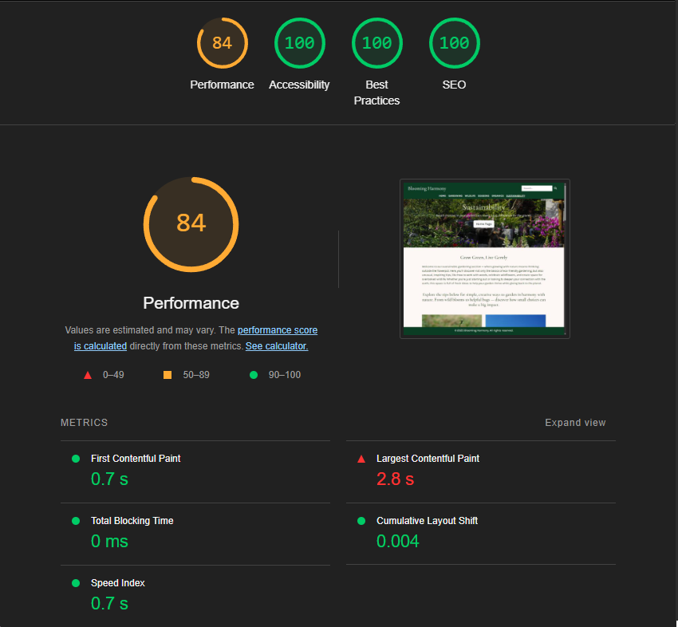

## Table of Contents

1. [CSS Validation](#css)
2. [HTML Validation](#html)
   - [About Us](#about-us)
   - [Contact Us](#contact-us)
   - [Gardening](#gardening)
   - [Homepage](#homepage)
   - [Introduction to Seasons](#introduction-to-seasons-article)
   - [Introduction to Sustainable Gardening](#introduction-to-garden-sustainable-article)
   - [Organics](#organics)
   - [Seasons](#seasons)
   - [Subscribe Thank You](#subscribe-thank-you)
   - [Sustainability](#sustainability)
   - [Contact Us Thank You](#contact-us-thank-you)
   - [Timeline Seasons](#timeline-seasons)
   - [Welcome](#welcome)
   - [Wildlife](#wildlife)
3. [Performance Validation](#performance)
4. [Accessibility Validation](#accessibility)
5. [Best Practices Validation](#best-practices)
6. [SEO Validation](#seo)
7. [Lighthouse Validation Results](#lighthouse-validation-results)
   - [Thank You - Desktop](#thank-you-desktop)
   - [Thank You - Mobile](#thank-you-mobile)
   - [Contact Us - Desktop](#contact-us-desktop)
   - [Contact Us - Mobile](#contact-us-mobile)
   - [About Us - Desktop](#about-us-desktop)
   - [About Us - Mobile](#about-us-mobile)
   - [Introduction - Desktop](#introduction-desktop)
   - [Introduction - Mobile](#introduction-mobile)
   - [Welcome - Desktop](#welcome-desktop)
   - [Welcome - Mobile](#welcome-mobile)
   - [Sustainability - Desktop](#sustainability-desktop)
   - [Sustainability - Mobile](#sustainability-mobile)
   - [Organics - Desktop](#organics-desktop)
   - [Organics - Mobile](#organics-mobile)
   - [Seasons - Desktop](#seasons-desktop)
   - [Seasons - Mobile](#seasons-mobile)
   - [Wildlife - Desktop](#wildlife-desktop)
   - [Wildlife - Mobile](#wildlife-mobile)
   - [Gardening - Desktop](#gardening-desktop)
   - [Gardening - Mobile](#gardening-mobile)
   - [Homepage - Desktop](#homepage-desktop)
   - [Homepage - Mobile](#homepage-mobile)

### CSS
For validating my style sheet I used a validator from [W3C Validation Service](https://jigsaw.w3.org/css-validator/#validate_by_input).
The validation returned no errors, only a few warnings that can be ignored. Please see the results of the validation below. 

[css-file](assets/css/style.css)

### HTML
I also validated each of my HTML files using the [W3C Validation Service](https://validator.w3.org/#validate_by_input).
There are no erros or warnings on the HTML validations. Below are the validation results for my HTML pages.

#### About Us
[about-us-html-file](about.html)

#### Contact Us
[contact-us-html-file](contact.html)

#### Gardening
[gardening-html-file](gardening.html)

#### Homepage
[homepage-html-file](index.html)

#### Introduction to seasons article
[introduction-to-seasons-html-file](introduction-seasons.html)

#### Introduction to garden sustainable article
[introduction-to-garden-sustainable-html-file](introduction.html)

#### Organics
[organics-html-file](organics.html)

#### Seasons
[seasons-html-file](seasons.html)

#### Subscribe Thank you
[subscribe-thankyou-html-file](subscribeThankYou.html)

#### Sustainability
[sustainability-html-file](sustainability.html)

#### Contact Us Thank you
[contact-us-thankyou-html-file](thankyou.html)

#### Timeline seasons
[timeline-seasons-html-file](timeline.html)

#### Welcome
[welcome-html-file](welcome.html)

#### Wildlife
[wildlife-html-file](wildlife.html)

---

**Performance, Accessibility, Best Practices and SEO validations were carried out using the Lighthouse developer tool**

The table below provides the reference ranges and explanations for Lighthouse scores.

| Category        | Score Range | Color Indicator | Explanation                                                                 |
|----------------|-------------|------------------|------------------------------------------------------------------------------|
| **Performance** | 90–100      | 🟢 Green         | Fast site loading and good runtime performance.                             |
|                 | 50–89       | 🟡 Orange        | Moderate performance; room for improvement.                                 |
|                 | 0–49        | 🔴 Red           | Poor performance; likely slow loading and resource-heavy.                   |
| **Accessibility** | 90–100    | 🟢 Green         | Most users, including those with disabilities, can navigate the content.    |
|                 | 50–89       | 🟡 Orange        | Some accessibility issues that may block certain users.                     |
|                 | 0–49        | 🔴 Red           | Major accessibility barriers for users with disabilities.                   |
| **Best Practices** | 90–100   | 🟢 Green         | Secure, modern web practices are followed.                                  |
|                 | 50–89       | 🟡 Orange        | Some outdated or risky practices found.                                     |
|                 | 0–49        | 🔴 Red           | Several critical issues affecting reliability or security.                  |
| **SEO**         | 90–100      | 🟢 Green         | Good visibility to search engines and adherence to SEO basics.              |
|                 | 50–89       | 🟡 Orange        | SEO could be improved for better search engine indexing.                    |
|                 | 0–49        | 🔴 Red           | Poor SEO setup, affecting discoverability.                                  |

### Performance
Performance validation received the lowest score among all Lighthouse categories, averaging 74%. 
While the target is ideally 90% or higher, the lower performance score is mainly due to large image files that delay page loading. 
I explore this further in the [Limitations](README.md#image-sizing) section, as it represents a key opportunity for improvement in future projects.

### Accessibility
Accessibility validation resulted in a score of 100%.

### Best Practices
Best Practices validation resulted in a score of 100%.

### SEO
SEO validation resulted in a score of 100%.

Please see the results of the validation below. 

#### Thank You - Desktop

#### Thank You - Mobile

#### Contact Us - Desktop

#### Contact Us - Mobile

#### About Us - Desktop

#### About Us - Mobile

#### Introduction - Desktop

#### Introduction - Mobile

#### Welcome - Desktop

#### Welcome - Mobile

#### Sustainability - Desktop

#### Sustainability - Mobile

#### Organics - Desktop

#### Organics - Mobile

#### Seasons - Desktop

#### Seasons - Mobile

#### Wildlife - Desktop

#### Wildlife - Mobile

#### Gardening - Desktop

#### Gardening - Mobile

#### Homepage - Desktop

#### Homepage - Mobile

